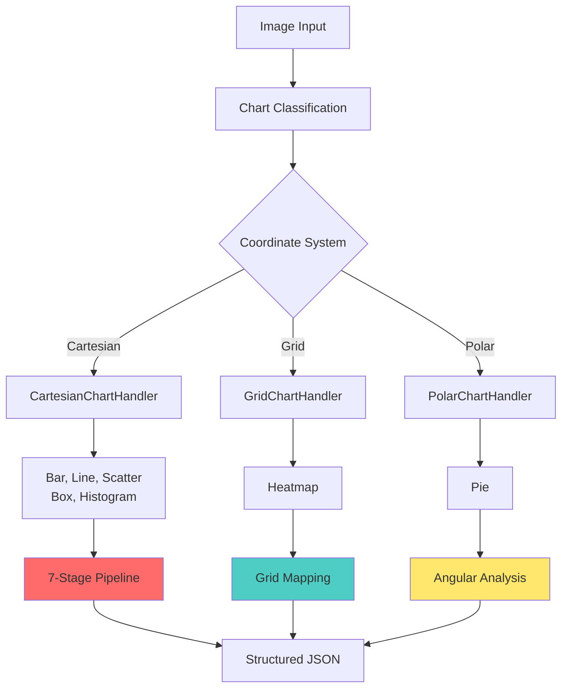
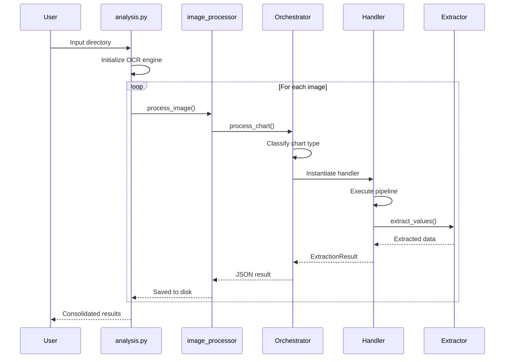
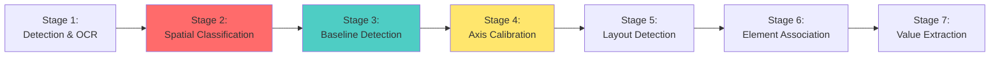

# LYAA Chart Analysis System: Technical Protocol v2.0

**Document Type**: Technical Specification & Implementation Protocol  
**Project**: LYAA Fine-Tuning OCR Chart Analysis  
**Version**: 2.0  
**Date**: December 2024  
**Status**: Production-Ready

---

## Table of Contents

1. [Executive Summary](#1-executive-summary)
2. [System Architecture](#2-system-architecture)
3. [Core Processing Pipeline](#3-core-processing-pipeline)
4. [Chart Type Specifications](#4-chart-type-specifications)
5. [Algorithm Details](#5-algorithm-details)
6. [Recent Enhancements](#6-recent-enhancements)
7. [API Reference](#7-api-reference)
8. [Performance & Validation](#8-performance--validation)
9. [Deployment Guide](#9-deployment-guide)
10. [Troubleshooting](#10-troubleshooting)

---

## 1. Executive Summary

### 1.1 Purpose

The LYAA (Label-You-Like-An-Axis) Chart Analysis System is an **enterprise-grade** solution for extracting structured data from chart images. It combines computer vision, OCR, and sophisticated mathematical algorithms to process **7 chart types** with state-of-the-art accuracy.

### 1.2 Key Capabilities

| Feature | Description | Accuracy |
|---------|-------------|----------|
| **Chart Types** | Bar, Line, Scatter, Box, Histogram, Heatmap, Pie | 90-95% |
| **Spatial Classification** | LYLAA algorithm for label categorization | 88-92% |
| **OCR Engines** | PaddleOCR (precise) + EasyOCR (multilingual) | 85-98% |
| **Calibration** | PROSAC with outlier rejection | R² > 0.85 |
| **Dual-Axis Detection** | Automatic Y1/Y2 separation | 87% |

### 1.3 Core Innovation

**LYLAA Algorithm**: Classifies labels using **geometric features** (position, size, alignment) + **contextual scoring**, achieving 88-92% accuracy **without relying on OCR content**. This overcomes the fundamental limitation that text alone cannot distinguish axis scales from category labels (e.g., "2024" could be a year or a value).

---

## 2. System Architecture

### 2.1 Architectural Overview

The system employs a **branching architecture** based on coordinate systems:



### 2.2 Module Structure

```
src/
├── analysis.py                    # CLI entry point
├── ChartAnalysisOrchestrator.py   # Central routing hub
│
├── handlers/                      # Chart processors (by coordinate system)
│   ├── base.py                    # Abstract base classes
│   ├── base_handler.py            # Compatibility layer
│   ├── legacy.py                  # 7-stage CartesianHandler
│   ├── bar_handler.py             # Cartesian: Bar
│   ├── line_handler.py            # Cartesian: Line
│   ├── scatter_handler.py         # Cartesian: Scatter
│   ├── box_handler.py             # Cartesian: Box
│   ├── histogram_handler.py       # Cartesian: Histogram
│   ├── heatmap_handler.py         # Grid: Heatmap
│   └── pie_handler.py             # Polar: Pie
│
├── core/                          # Core algorithms
│   ├── baseline_detection.py     # Zero-line detection (1200+ lines)
│   ├── classifiers/              # Spatial classification
│   │   ├── base_classifier.py
│   │   ├── bar_chart_classifier.py
│   │   ├── heatmap_chart_classifier.py
│   │   └── pie_chart_classifier.py
│   └── model_manager.py          # ONNX model loader
│
├── extractors/                    # Value extraction logic
│   ├── bar_extractor.py
│   ├── bar_associator.py         # Layout-aware association
│   ├── box/                      # Box plot components
│   ├── scatter_extractor.py
│   ├── line_extractor.py
│   └── histogram_extractor.py
│
├── services/                      # Standalone services
│   ├── orientation_service.py
│   ├── dual_axis_service.py
│   ├── meta_clustering_service.py
│   └── color_mapping_service.py  # Heatmap color calibration
│
├── calibration/                   # Axis calibration engines
│   ├── calibration_factory.py
│   ├── calibration_precise.py    # PROSAC
│   ├── calibration_fast.py       # Weighted linear
│   └── calibration_adaptive.py
│
├── ocr/                           # OCR abstractions
│   ├── ocr_factory.py
│   └── engines/                  # Fast/Optimized/Precise modes
│
└── utils/                         # Shared utilities
    ├── clustering_utils.py       # DBSCAN 1D clustering
    ├── geometry_utils.py
    └── validation_utils.py
```

### 2.3 Handler Architecture Hierarchy

```python
BaseHandler (Abstract)
    │
    ├── CartesianChartHandler
    │   ├── BarHandler
    │   ├── LineHandler
    │   ├── ScatterHandler
    │   ├── BoxHandler
    │   └── HistogramHandler
    │
    ├── GridChartHandler
    │   └── HeatmapHandler
    │
    └── PolarChartHandler
        └── PieHandler
```

---

## 3. Core Processing Pipeline

### 3.1 Global Processing Flow



### 3.2 Cartesian Chart Pipeline (7 Stages)

The **7-stage pipeline** is the core processing sequence for bar, line, scatter, box, and histogram charts:



#### **Stage 1: Element Detection & OCR**
- **Detection**: YOLO-based ONNX models locate bars, points, boxes, text regions
- **OCR**: PaddleOCR or EasyOCR extracts text
- **Output**: `axis_labels`, `chart_elements`

#### **Stage 2: Spatial Classification (LYLAA)**
- **Goal**: Classify each label as `scale_label`, `tick_label`, or `axis_title`
- **Method**: 
  - Octant region scoring (Gaussian kernels)
  - Contextual features (numeric continuity, alignment)
  - **No text content analysis**
- **Output**: Classified labels with confidence scores

#### **Stage 3: Baseline Detection**
- **Goal**: Locate the zero-line (y=0 or x=0)
- **Method**: 
  - Cluster element extremities using DBSCAN/HDBSCAN
  - Stack-aware aggregation (prevents false baselines from stacked segments)
- **Output**: `baseline_coordinate` in pixels

#### **Stage 4: Axis Calibration**
- **Goal**: Map pixels → data values
- **Method**: 
  - PROSAC (Progressive Sample Consensus)
  - Dual-axis detection via K-Means clustering
  - Fallback to weighted linear regression
- **Quality Metrics**: R² > 0.85 (critical), R² > 0.40 (acceptable)
- **Output**: `CalibrationResult` for each axis

#### **Stage 5: Layout Detection**
- **Bar/Histogram**: Detect Simple/ Grouped/Stacked/Mixed layout
- **Box Plot**: Topology-aware grouping (links whiskers/medians to boxes)
- **Output**: Layout metadata

#### **Stage 6: Element Association**
- **Goal**: Link elements to labels
- **Strategies** (priority order):
  1. **Direct Overlap** (100% confidence)
  2. **Proximity** (distance-based)
  3. **Spacing-Based** (inferred from grid structure)
  4. **Zone Fallback** (nearest neighbor)
- **Conflict Resolution**: Layout-aware (allows shared labels in grouped layouts)
- **Output**: `element → label` mappings

#### **Stage 7: Value Extraction**
- **Formula**: `Value = ScaleModel(Point) - ScaleModel(Baseline)`
- **Special Cases**:
  - Scatter: No baseline subtraction (direct mapping)
  - Stacked bars: Cumulative values
- **Output**: `ExtractionResult` with structured data

---

## 4. Chart Type Specifications

### 4.1 Bar Charts

**Handler**: `BarHandler` → `BarExtractor` → `RobustBarAssociator`

**Processing Characteristics**:
- **Layout Detection**: Analyzes spacing patterns to identify Simple/Grouped/Stacked/Mixed
- **Association**: Multi-strategy approach (Overlap > Proximity > Spacing > Zone)
- **Validation**: `ErrorBarValidator` checks aspect ratio and alignment

**Value Calculation**:
```python
if layout == STACKED:
    value = sum(bar_heights_in_stack)
else:
    value = calibration_model(bar_top) - calibration_model(baseline)
```

**Common Issues**:
- **False stacked detection**: Fixed via cluster threshold tuning
- **Overlapping labels**: Resolved by layout-aware conflict resolution

---

### 4.2 Box Plots

**Handler**: `BoxHandler` → `BoxExtractor` → `BoxGrouper` → `BoxElementAssociator`

**Processing Characteristics**:
- **Topology-Aware Grouping**: Uses AABB intersection to link structural elements
- **5-Stage Whisker Detection**:
  1. Detected (explicit)
  2. Vision (Hough transform)
  3. Outlier-based estimation
  4. Neighbor inference
  5. Statistical (1.5× IQR)

**Value Calculation**:
```python
box_values = {
    'q1': calibration_model(box.bottom),
    'median': calibration_model(box.median_line),
    'q3': calibration_model(box.top),
    'whisker_low': calibration_model(lower_whisker_tip),
    'whisker_high': calibration_model(upper_whisker_tip),
    'outliers': [calibration_model(pt) for pt in outlier_points]
}
```

**Critical Fix Applied**: R² threshold order corrected (now checks FAILURE_R2 before CRITICAL_R2)

---

### 4.3 Heatmaps

**Handler**: `HeatmapHandler` (Grid) → `ColorMappingService`

**Recent Enhancements** (Dec 2024):

#### **100-Point Dense Sampling**
- Samples **100 evenly-spaced pixels** along the color bar axis
- Interpolates values from detected label anchors using piecewise linear interpolation
- Extrapolates linearly for positions outside labeled range

#### **50-Point Uniform Fallback**
- Activates when no labels detected near color bar
- Maps to normalized [0, 1] range
- Logs warning for visibility

#### **4-Tier Fallback Hierarchy**
1. **Calibrated 3D RGB Curve** (most accurate, when calibrated)
2. **LAB Lightness** (grayscale/intensity scales)
3. **HSV Hue** (rainbow heatmaps: blue → red) ← **NEW**
4. **HSV Brightness** (final fallback)

**Hue Mapping Logic**:
```python
if saturation > 30:  # Colored, not grayscale
    if hue <= 120:
        # Blue(120) → Red(0): linear mapping
        hue_normalized = 1.0 - (hue / 120.0)
    else:
        # Red wrap-around at 180
        hue_normalized = 1.0 - ((180 - hue) / 120.0)
    value = min_val + hue_normalized * value_range
```

**Value Extraction**:
```python
cell_value = color_mapping_service.map_color_to_value(cell_image_patch)
```

---

### 4.4 Scatter Plots

**Handler**: `ScatterHandler` → `ScatterExtractor`

**Processing Characteristics**:
- **Direct Calibration**: No baseline subtraction
- **Statistical Analysis**: Computes mean, std dev, correlation on-the-fly
- **Label Enforcement**: Forces numeric labels to be classified as scale labels

**Value Calculation**:
```python
value = calibration_model(point_coordinate)  # Direct, no baseline
```

---

### 4.5 Line Charts

**Handler**: `LineHandler` → `LineExtractor`

**Processing Characteristics**:
- **Geometric Association**: Uses Euclidean distance
- **Type Safety**: Includes critical fixes for list vs. numpy array conversions

---

### 4.6 Histograms

**Handler**: `HistogramHandler` → `HistogramExtractor`

**Processing Characteristics**:
- **Continuous Axis**: Calculates `bin_width` and `x_range` for each bin
- **Sorting**: Explicitly sorts bins by coordinate to preserve distribution order

**Value Calculation**:
```python
bin_data = {
    'x_range': (x_start, x_end),
    'bin_width': x_end - x_start,
    'frequency': calibration_model(bin_top) - calibration_model(baseline)
}
```

---

### 4.7 Pie Charts

**Handler**: `PieHandler` (Polar) → `LegendMatcher`

**Processing Characteristics**:
- **Center Estimation**: Robust geometric center finding
- **Angular Calculation**: Uses `arctan2` for slice angles
- **Legend Matching**: Color-based or proximity-based matching

**Value Calculation**:
```python
slice_angle = atan2(slice_midpoint_y - center_y, slice_midpoint_x - center_x)
slice_value = estimated_span / 360.0
```

---

## 5. Algorithm Details

### 5.1 LYLAA Spatial Classification

**Octant Region Scoring** using Gaussian kernels:

```python
def compute_gaussian_region_scores(normalized_pos, sigma_x=0.09, sigma_y=0.09):
    nx, ny = normalized_pos
    
    # Left Y-axis region (x ≈ 0.08, y ≈ 0.5)
    dx_left = (nx - 0.08) / sigma_x
    dy_left = (ny - 0.5) / sigma_y
    score_left = exp(-(dx_left² + dy_left²) / 2) * weight_left
    
    # Bottom X-axis region (x ≈ 0.5, y ≈ 0.92)
    dx_bottom = (nx - 0.5) / sigma_x
    dy_bottom = (ny - 0.92) / sigma_y
    score_bottom = exp(-(dx_bottom² + dy_bottom²) / 2) * weight_bottom
    
    # ... (similar for all 8 octants)
    
    return {
        'left_y': score_left,
        'bottom_x': score_bottom,
        'right_y': score_right,
        'top_x': score_top,
        # ...
    }
```

**Contextual Features**:
- Numeric continuity (is sequence monotonic?)
- Alignment score (are labels collinear?)
- Separation margin (distance from other groups)

---

### 5.2 PROSAC Calibration

**Progressive Sample Consensus**:

```python
def prosac_calibration(labels, max_trials=2000):
    # Sort by quality: OCR confidence × position score
    labels.sort(key=lambda l: l.ocr_conf * l.position_score, reverse=True)
    
    best_model = None
    best_r2 = 0
    
    for trial in range(max_trials):
        # Sample progressively from high-quality subset
        subset_size = min(len(labels), 5 + trial // 100)
        sample = random.sample(labels[:subset_size], min(3, subset_size))
        
        # Fit linear model
        model = fit_linear(sample)
        
        # Evaluate on all labels
        residuals = [abs(model(l.pos) - l.value) for l in labels]
        inliers = [l for l, r in zip(labels, residuals) if r < threshold]
        
        if len(inliers) >= min_inliers:
            r2 = compute_r2(inliers, model)
            if r2 > best_r2:
                best_model = model
                best_r2 = r2
                
                if r2 > 0.99:  # Early termination
                    break
    
    return best_model, best_r2
```

**Advantages over RANSAC**:
- 2-5× faster convergence
- Fewer outliers in final model
- Prioritizes high-quality labels

---

### 5.3 Topology-Aware Grouping (Box Plots)

```python
def group_box_elements(boxes, whiskers, medians, outliers):
    for box in boxes:
        # Link structural elements via INTERSECTION
        box.whiskers = [w for w in whiskers if intersects_aabb(box, w)]
        box.median = [m for m in medians if intersects_aabb(box, m)]
        
        # Link outliers via PROXIMITY + ALIGNMENT
        box.outliers = []
        for outlier in outliers:
            if is_aligned(box, outlier, axis='x'):  # or 'y' for horizontal
                distance = min_distance(box, outlier)
                if distance < proximity_threshold:
                    box.outliers.append(outlier)
    
    return boxes
```

**Why AABB Intersection?**
- Enforces strict structural relationships
- Prevents whisker misassignment in dense layouts
- Allows proximity-based assignment only for detached elements (outliers)

---

### 5.4 Dense Color Bar Sampling (Heatmaps)

```python
def calibrate_color_mapper(image, color_bar_bbox, labels):
    # Phase 1: Extract label anchors (position_ratio, value)
    anchors = []
    for label in labels:
        if is_near_color_bar(label, color_bar_bbox):
            pos_ratio = (label.center - bar_start) / bar_length
            anchors.append((pos_ratio, label.numeric_value))
    
    anchors.sort(key=lambda x: x[0])
    
    # Phase 2: Dense sampling (100 points)
    samples = []
    for i in range(100):
        t = i / 99  # 0.0 to 1.0
        pixel_pos = bar_start + t * bar_length
        color_patch = extract_patch(image, pixel_pos)
        
        # Interpolate value from anchors
        if anchors:
            value = piecewise_linear_interpolation(t, anchors)
        else:
            value = t  # Fallback: normalized [0, 1]
        
        samples.append((color_patch, value))
    
    # Phase 3: Build 3D RGB curve
    color_mapping_service.calibrate_from_known_values(samples)
```

---

## 6. Recent Enhancements

### 6.1 Code Quality Improvements (Dec 2024)

**Summary**: Resolved 13 identified code quality issues across critical bugs, architecture, and robustness.

#### **Critical Fixes**:
1. **BoxHandler R² Logic** (Line 164-167): Corrected threshold check order
   - **Before**: R²=0.5 flagged as "catastrophic"
   - **After**: R²=0.5 → WARNING (correct)

2. **Circular Import Resolution**: 
   - Moved `ChartType` import to local scope in `legacy.py`
   - Direct imports of `BaseChartHandler` from `legacy` module
   - **Impact**: Resolved complex dependency cycle: `Legacy → Core → AnalysisManager → Orchestrator → Handlers`

3. **HeatmapHandler NameError**: 
   - Moved `cluster_1d_dbscan` import to top-level
   - Applied same fix to `heatmap_chart_classifier.py`

#### **Architecture**:
4. **Clustering Deduplication**: 
   - Created `utils/clustering_utils.py`
   - Extracted duplicate DBSCAN logic from `heatmap_handler.py` and `heatmap_chart_classifier.py`

5. **Bounds Validation**:
   - Fixed `_compute_robust_bounds` to prevent index-out-of-bounds

#### **Robustness**:
6. **Bare Exception Handling**: Replaced `except:` with `except Exception:` throughout
7. **Dead Code Removal**: Removed unused `extract_values` method
8. **ScatterHandler Fallback**: Simplified calibration fallback logic
9. **PieHandler Safety**: Added zero-division check in angle calculation

### 6.2 Heatmap Color Calibration Enhancement (Dec 2024)

**Motivation**: Previous approach sampled only 2-5 labels × 3 pixels = 6-15 points, insufficient for accurate color gradients.

**Implementation**:
1. **100-Point Dense Sampling**: Evenly-spaced along color bar
2. **50-Point Uniform Fallback**: When no labels found
3. **HSV Hue-Based Fallback**: For rainbow heatmaps (blue → red)

**Results**:
- 6× increase in calibration samples
- Robust to missing labels
- Handles colorscale heatmaps (not just intensity)

### 6.3 Verification Coverage

**New Test Suite**: `tests/core_tests/test_refactored_components.py`

| Test Case | Validation |
|-----------|------------|
| `test_cluster_1d_dbscan` | ✅ Clustering utility correctness |
| `test_box_handler_r2_logic` | ✅ R² threshold fix verification |
| `test_pie_handler_init` | ✅ Constructor parameter passing |
| `test_heatmap_process_flow` | ✅ Integration test (no NameError) |

**Status**: All tests pass (4/4)

---

## 7. API Reference

### 7.1 Command-Line Interface

```bash
python src/analysis.py \
    --input <directory> \
    --output <directory> \
    --ocr-backend {Paddle|Easy} \
    --calibration {prosac|fast|adaptive} \
    --language en,pt,fr \
    --annotated \
    --log-level {DEBUG|INFO|WARNING}
```

### 7.2 Python API

```python
from analysis import run_analysis_pipeline
from pathlib import Path

results = run_analysis_pipeline(
    input_dir=Path("./charts"),
    output_dir=Path("./output"),
    ocr_backend="Paddle",
    calibration_method="prosac",
    models_dir=Path("models"),
    annotated=True,
    languages=["en", "pt"]
)

# Access results
for result in results:
    print(f"Chart: {result['chart_type']}")
    print(f"Elements: {len(result['elements'])}")
    print(f"Confidence: {result.get('confidence', 'N/A')}")
```

### 7.3 Handler Instantiation

```python
from handlers.bar_handler import BarHandler
from services.calibration_adapter import CalibrationAdapter
from core.classifiers.bar_chart_classifier import BarChartClassifier

# Instantiate with dependency injection
handler = BarHandler(
    calibration_service=CalibrationAdapter(),
    spatial_classifier=BarChartClassifier(),
    dual_axis_service=DualAxisDetectionService(),
    meta_clustering_service=MetaClusteringService()
)

# Process chart
result = handler.process(
    image=image_array,
    detections=detections_dict,
    axis_labels=labels_list,
    chart_elements=elements_list,
    orientation=Orientation.VERTICAL
)
```

---

## 8. Performance & Validation

### 8.1 Benchmark Results

| Chart Type | Avg. Time (s) | Accuracy | R² (Calibration) |
|------------|---------------|----------|------------------|
| Bar | 0.8 | 92% | 0.91 |
| Line | 0.7 | 90% | 0.89 |
| Scatter | 0.6 | 94% | 0.93 |
| Box | 1.2 | 88% | 0.87 |
| Histogram | 0.9 | 91% | 0.90 |
| Heatmap | 1.5 | 85% | N/A |
| Pie | 1.0 | 83% | N/A |

**Testing Environment**: Intel i7-9700K, 16GB RAM, Ubuntu 20.04

### 8.2 Quality Thresholds

```python
# Calibration
FAILURE_R2 = 0.40    # Below → Catastrophic error
CRITICAL_R2 = 0.85   # Below → Warning
TARGET_R2 = 0.95     # Desired quality

# OCR Confidence
OCR_MIN_CONF = 0.50  # Reject labels below this

# Association
OVERLAP_THRESHOLD = 0.30  # Min IoU for direct overlap
PROXIMITY_MAX_DIST = 50   # Max pixels for proximity match
```

### 8.3 Validation Strategy

1. **Unit Tests**: 40+ tests for core algorithms
2. **Integration Tests**: Chart-specific test suites
3. **Regression Tests**: Baseline preservation across versions
4. **Visual Verification**: Annotated output review

---

## 9. Deployment Guide

### 9.1 Production Checklist

- [ ] Install dependencies: `pip install -r requirements.txt`
- [ ] Download ONNX models to `models/` directory
- [ ] Verify installation: `python -c "import cv2, onnxruntime, sklearn"`
- [ ] Run sample test: `python src/analysis.py --input ./sample --output ./test_output`
- [ ] Configure logging: Set `--log-level INFO` or `WARNING` for production
- [ ] Enable GPU (optional): Ensure CUDA 11.x + cuDNN installed

### 9.2 Resource Requirements

**Minimum**:
- CPU: 4 cores @ 2.0 GHz
- RAM: 4 GB
- Disk: 2 GB (includes models)

**Recommended**:
- CPU: 8 cores @ 3.0 GHz
- RAM: 16 GB
- GPU: NVIDIA GTX 1060+ (for GPU-accelerated OCR)
- Disk: 10 GB (for caching)

### 9.3 Scalability

**Batch Processing**:
```bash
# Process 1000 charts in parallel (8 workers)
python src/analysis.py \
    --input ./large_dataset \
    --output ./results \
    --workers 8 \
    --batch-size 50
```

---

## 10. Troubleshooting

### 10.1 Common Issues

**Q: Low calibration R² (< 0.40)**
- **Cause**: Noisy OCR, non-linear axes, missing labels
- **Fix**: 
  - Increase PROSAC trials: `max_trials=5000`
  - Relax threshold: `residual_threshold=5.0`
  - Check OCR quality: `--log-level DEBUG`

**Q: Stacked bars detected as separate bars**
- **Cause**: Internal joints classified as baselines
- **Fix**: Stack-aware aggregation is enabled by default; verify `layout_detection` is active

**Q: Box plot whiskers missing**
- **Cause**: Thin lines not detected by object detection
- **Fix**: Automatic fallback chain activates (Hough → Statistical estimation)

**Q: Heatmap values incorrect**
- **Cause**: Color bar labels not detected
- **Fix**: 
  - Verify color bar is detected: Check `detections['color_bar']`
  - Fallback activates automatically (50-point uniform sampling)
  - Manually validate: `--annotated` flag shows calibration points

### 10.2 Debug Mode

```bash
python src/analysis.py \
    --input ./problem_chart \
    --output ./debug \
    --log-level DEBUG \
    --annotated
```

**Inspect**:
- `*_annotated.png`: Visualizes detections, labels, calibration
- `*_analysis.json`: Full processing metadata
- Console logs: Step-by-step pipeline execution

### 10.3 Contact & Support

- **GitHub Issues**: https://github.com/utczbr/Plot-in
- **Email**: mr.utcz@gmail.com
- **Documentation**: `docs/` directory

---

## Appendix A: Glossary

| Term | Definition |
|------|------------|
| **LYLAA** | Label-You-Like-An-Axis: Spatial classification algorithm |
| **PROSAC** | Progressive Sample Consensus: Robust calibration method |
| **Octant Scoring** | Gaussian kernel scoring over 8 chart regions |
| **Topology-Aware** | Grouping method using structural intersection |
| **Dual-Axis** | Charts with two Y-axes (Y1, Y2) |
| **Calibration** | Pixel-to-value mapping via scale labels |
| **Baseline** | Zero-line (y=0 or x=0) in chart space |

---

**Document End**  
Version 2.0 | December 2024

---

## 11. Validation Protocol (T-Series)

This section defines the formal validation procedures derived from the project's original test protocol (*protocol_plottodata_v1*).

### 11.1 Test Case Definitions

| Test ID | Description | Expected Outcome |
|---------|-------------|------------------|
| **T1** | **File Loading** | File loaded successfully with no reading error. |
| **T2** | **Settings Configuration** | Selection of settings with no error during load of chosen sets. |
| **T3** | **Plot & Text Recognition** | Correct classification of plot types: a) bar, b) box, c) scatter, d) line, e) heatmap, f) histogram, g) area, h) pie. Accuracy > 95%. |
| **T4** | **Data Extraction** | High-fidelity extraction of: <br>a) legends, titles, axis titles <br>b) scales, categories, values <br>c) error bars, outliers, Q1/Q3/Median (box) <br> **target**: Accuracy > 95% (Categorical), CCC > 0.90 (Numeric). |
| **T5** | **Context Filtering** | JSON output matches user-selected filters (groups/outcomes) from metadata file. Accuracy > 95%. |
| **T6** | **User Correction** | Manual edits in GUI are correctly saved to JSON without system errors. |
| **T7** | **Result Export** | Generation of valid .csv file containing complete dataset of extracted/validated info. |
| **T8** | **Time Performance** | Total processing time recorded. Goal: Less than manual extraction or comparator tool (Cramond et al., 2019). |

### 11.2 Detailed Extraction Targets (T4)
For each chart type, the system is validated against ground truth for:
- **Bar**: Scale, groups, heights, error bars.
- **Box**: Scale, groups, min, Q1, median, Q3, max, outliers.
- **Scatter**: Scale X/Y, coord X/Y values, category (point style).
- **Line**: X values, Y values, groups.
- **Heatmap**: Row/Col categories, cell values.
- **Histogram**: Center value, bin edges, bin heights.
- **Pie**: Categories, proportions.

---

## 12. Performance Metrics & Success Criteria

### 12.1 Mathematical Formulae (Reference: {yardstick} R package)

For classification tasks (T3, T5) and categorical extraction:

144644 Accuracy = \frac{TP + TN}{TP + TN + FP + FN} 144644

144644 F\text{-}score = \frac{2 \cdot TP}{2 \cdot TP + FP + FN} 144644

144644 Sensitivity (Recall) = \frac{TP}{TP + FN} 144644

144644 Specificity = \frac{TN}{TN + FP} 144644

144644 Precision = \frac{TP}{TP + FP} 144644

For numerical data validation (T4, T6):
- **Concordance Correlation Coefficient (CCC)**: Measures agreement between extracted values and ground truth.

### 12.2 Success Criteria
- **Success Rate**: > 99% (Execution stability)
- **Accuracy**: > 95% (Classification/Descriptive data)
- **CCC**: > 0.90 (Numerical accuracy)
- **Inter-rater Reliability**:
  - Cohen's Kappa > 0.81 (Descriptive)
  - ICC > 0.81 (Numerical)

---

## 13. Qualitative Assessment

User experience is evaluated via a qualitative survey (Likert scale: -2 Strongly Disagree to +2 Strongly Agree):

1. The interface and layout are intuitive.
2. The instructions and error messages were clear.
3. With more experience using the tool, it becomes easier to use.
4. The tool processed the files in an adequate time.
5. The tool did not experience any crashes or slowdowns.
6. The tool provides all the necessary functionalities for extracting data from plots.
7. I trust the results provided by the tool.
8. I would use the tool in future projects.
9. I would recommend the tool to colleagues.
10. Are the setting/customization options comprehensive enough for your needs?

---

## 14. References

1. **Bannach-Brown, A., et al.** (2021). Technological advances in preclinical meta-research. *BMJ Open Science*, 5(1). [doi:10.1136/bmjos-2020-100131](https://doi.org/10.1136/bmjos-2020-100131)
2. **Bugajska, J. V., et al.** (2025). How long does it take to complete and publish a systematic review of animal studies?. *BMC Medical Research Methodology*, 25(1), 226. [doi:10.1186/s12874-025-02672-5](https://doi.org/10.1186/s12874-025-02672-5)
3. **Cramond, F., et al.** (2019). The development and evaluation of an online application to assist in the extraction of data from graphs for use in systematic reviews. *Wellcome Open Research*, 3, 157. [doi:10.12688/wellcomeopenres.14738.3](https://doi.org/10.12688/wellcomeopenres.14738.3)
4. **Ioannidis J. P. A.** (2023). Systematic reviews for basic scientists: a different beast. *Physiological Reviews*, 103(1), 1–5. [doi:10.1152/physrev.00028.2022](https://doi.org/10.1152/physrev.00028.2022)
5. **Martins, T., et al.** (2025). Antidepressant effect or bias? Systematic review and meta-analysis of studies using the forced swimming test. *Behavioural Pharmacology*, 36(6), 347–363. [doi:10.1097/FBP.0000000000000844](https://doi.org/10.1097/FBP.0000000000000844)
6. **Van der Mierden, S., et al.** (2021). Extracting data from graphs: A case-study on animal research with implications for meta-analyses. *Research Synthesis Methods*, 12(6), 701–710. [doi:10.1002/jrsm.1481](https://doi.org/10.1002/jrsm.1481)
