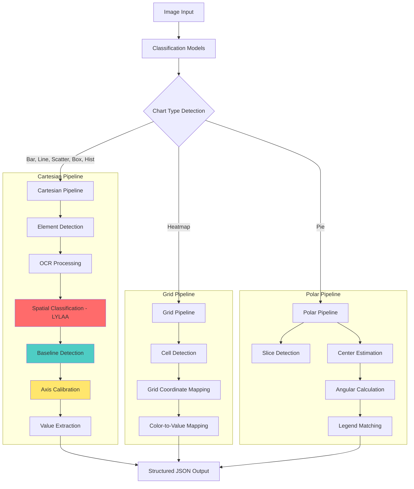
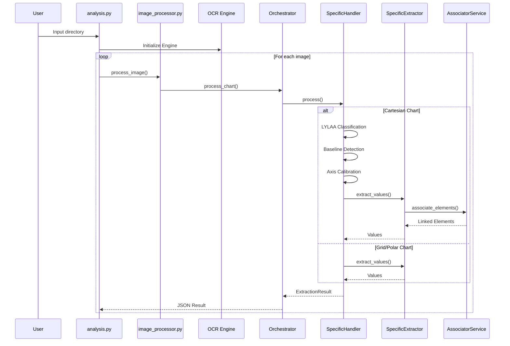

# LYAA Fine-Tuning OCR Chart Analysis System
## Comprehensive Architecture & Execution Flow Analysis

---

## Executive Summary

This is an **enterprise-grade chart analysis system** that extracts structured data from chart images using computer vision, OCR, and sophisticated mathematical algorithms. The system supports **bar, line, scatter, box plot, histogram, heatmap, and pie charts** with state-of-the-art accuracy.

**Key Innovation**: The **LYLAA (Label-You-Like-An-Axis)** spatial classification algorithm achieves 88-92% accuracy in distinguishing axis labels from tick labels without relying solely on OCR content.

---

## 1. Project Architecture Overview

### 1.1 High-Level Architecture

The system employs a branching architecture that routes processing based on the fundamental coordinate system of the chart.



### 1.2 Directory Structure

```
src/
├── analysis.py                    # Main CLI entry point
├── image_processor.py             # Single-image processing pipeline
├── ChartAnalysisOrchestrator.py   # Central routing hub
│
├── core/                          # Core algorithms
│   ├── baseline_detection.py     # Baseline detection (1200+ lines)
│   ├── spatial_classification_enhanced.py  # LYLAA algorithm (1000+ lines)
│   ├── model_manager.py          # ONNX model loader
│   ├── classifiers/              # Chart type classifiers
│   └── utils.py
│
├── handlers/                      # Chart-specific processors
│   ├── base_handler.py           # Abstract base with 7-stage pipeline
│   ├── bar_handler.py            # Cartesian: Bar
│   ├── line_handler.py           # Cartesian: Line
│   ├── scatter_handler.py        # Cartesian: Scatter
│   ├── box_handler.py            # Cartesian: Box
│   ├── histogram_handler.py      # Cartesian: Histogram
│   ├── heatmap_handler.py        # Grid: Heatmap
│   └── pie_handler.py            # Polar: Pie
│
├── extractors/                    # Element-specific extraction
│   ├── bar_extractor.py          # Bar extraction & value calc
│   ├── bar_associator.py         # Robust layout detection & association
│   ├── box/                      # Box plot components (Grouper, Associator)
│   ├── scatter_extractor.py      # Direct calibration mapping
│   ├── line_extractor.py         # Geometric association
│   ├── histogram_extractor.py    # Bin sorting & continuous axis
│   ├── smart_whisker_estimator.py # Box plot fallback logic
│   ├── error_bar_validator.py    # Statistical validation
│   └── significance_associator.py # Annotation linking
│
├── services/                      # Standalone services
│   ├── orientation_service.py
│   ├── dual_axis_service.py      # Detects dual Y-axes
│   ├── meta_clustering_service.py
│   └── calibration_adapter.py
│
├── calibration/                   # Axis calibration engines
│   ├── calibration_factory.py
│   ├── calibration_precise.py    # PROSAC algorithm
│   ├── calibration_fast.py       # Weighted linear
│   └── calibration_adaptive.py
│
├── ocr/                           # OCR engine abstractions
│   ├── ocr_factory.py
│   ├── engines/                  # Fast/Optimized/Precise modes
│   ├── orchestrator/             # Unified OCR system
│   └── preprocessing/            # Image enhancement
│
└── visual/                        # GUI components
    └── settings_dialog.py
```

---

## 2. Execution Flow: Step-by-Step

### 2.1 Overall Pipeline Sequence



### 2.2 Detailed Processing Stages (Cartesian)

#### **Stage 1: Element Detection & OCR**
- **Detection**: Uses ONNX models to find bars, points, boxes, text regions.
- **OCR**: Extracts text from detected regions using PaddleOCR or EasyOCR.

#### **Stage 2: Spatial Classification (LYLAA)**
- **Goal**: Distinguish `scale_label` (axis values) from `tick_label` (categories) and `axis_title`.
- **Method**: Uses geometric features (position, size, alignment) + context. **Does not rely on text content.**

#### **Stage 3: Baseline Detection**
- **Goal**: Find the zero-line.
- **Method**: Clustering (DBSCAN/HDBSCAN) of element extremities.
- **Stack-Awareness**: Aggregates stacked bar segments to avoid false baselines.

#### **Stage 4: Axis Calibration**
- **Goal**: Map pixels to data values.
- **Method**: **PROSAC** (Progressive Sample Consensus) to fit linear models to `scale_labels`.
- **Dual-Axis**: Detects and calibrates secondary Y-axes if label separation is high.

#### **Stage 5: Layout Detection & Grouping (New)**
- **Bar/Histogram**: Detects **Simple**, **Grouped**, **Stacked**, or **Mixed** layouts based on spacing analysis.
- **Box Plot**: Uses **Topology-Aware Grouping** to link whiskers, medians, and outliers to their parent box.

#### **Stage 6: Element Association**
- **Goal**: Link data elements to their corresponding labels.
- **Strategies**:
    1.  **Direct Overlap**: 100% confidence.
    2.  **Proximity**: Distance-based.
    3.  **Spacing-Based**: Inferred from grid structure.
    4.  **Zone Fallback**: Nearest neighbor in region.
- **Conflict Resolution**: Layout-aware logic (e.g., allows multiple bars per label in Grouped charts).

#### **Stage 7: Value Extraction**
- **Cartesian**: `Value = ScaleModel(Point) - ScaleModel(Baseline)`
- **Scatter**: `Value = ScaleModel(Point)` (Direct mapping, no baseline subtraction).
- **Grid/Polar**: Mapped from color intensity or angular position.

---

## 3. Chart-Specific Analysis Findings

### 3.1 Box Plots
- **Architecture**: `BoxHandler` → `BoxExtractor` → `BoxGrouper` → `BoxElementAssociator`.
- **Key Feature**: **Topology-Aware Grouping**. Uses intersection (AABB) to link whiskers/medians to boxes, and proximity for outliers.
- **Whisker Detection**: 5-stage priority chain:
    1.  **Detected**: Explicit visual detection.
    2.  **Vision**: Hough transform line detection.
    3.  **Outlier**: Estimated from outlier positions.
    4.  **Neighbor**: Inferred from adjacent boxes.
    5.  **Statistical**: 1.5x IQR fallback.

### 3.2 Bar Charts
- **Architecture**: `BarHandler` → `BarExtractor` → `RobustBarAssociator`.
- **Key Feature**: **Layout Detection**. Automatically identifies Stacked vs. Grouped layouts.
- **Association**: Uses a **Multi-Strategy** approach (Overlap > Proximity > Spacing > Zone) to robustly link bars to labels even in complex layouts.
- **Validation**: `ErrorBarValidator` checks aspect ratio and alignment.

### 3.3 Line Charts
- **Architecture**: `LineHandler` → `LineExtractor`.
- **Key Feature**: **Geometric Association**. Uses Euclidean distance to link data points to labels.
- **Fixes**: Includes critical type conversion fixes to prevent crashes with list vs. numpy arrays.

### 3.4 Scatter Plots
- **Architecture**: `ScatterHandler` → `ScatterExtractor`.
- **Key Feature**: **Direct Calibration**. Unlike other charts, scatter plots do not subtract baseline values; they map pixels directly to data coordinates.
- **Analysis**: Computes statistical metrics (Mean, Std Dev, Correlation) on the fly.
- **Fixes**: Forces numeric labels to be treated as scale labels to avoid misclassification.

### 3.5 Histograms
- **Architecture**: `HistogramHandler` → `HistogramExtractor`.
- **Key Feature**: **Continuous Axis Handling**. Calculates `bin_width` and `x_range` for each bin.
- **Sorting**: Explicitly sorts bins by coordinate to preserve distribution order.

### 3.6 Heatmaps
- **Architecture**: `HeatmapHandler` (Grid) → `ColorMapper`.
- **Key Feature**: **Grid Coordinate System**. Maps detections to `(row, col)` indices.
- **Value Extraction**: Uses `ColorMapper` service or falls back to HSV intensity analysis.

### 3.7 Pie Charts
- **Architecture**: `PieHandler` (Polar) → `LegendMatcher`.
- **Key Feature**: **Polar Coordinate System**. Estimates chart center and calculates slice angles (`arctan2`).
- **Limitations**: Currently uses placeholder logic for angle width; relies on legend matching for categorization.

---

## 4. Key Algorithms & Calculations

### 4.1 LYLAA Spatial Classification
**Octant Region Scoring** (Gaussian kernels):
```python
# Left Y-axis region score
dx = (nx - 0.08) / sigma_x
dy = (ny - 0.5) / sigma_y
score_left = exp(-(dx² + dy²) / 2) × weight_left
```

### 4.2 Topology-Aware Grouping (Box Plots)
```python
def group_elements(boxes, whiskers, medians):
    for box in boxes:
        # Link whiskers/medians that INTERSECT the box
        box.whiskers = [w for w in whiskers if intersects(box, w)]
        box.median = [m for m in medians if intersects(box, m)]
        # Link outliers that are PROXIMAL to the box axis
        box.outliers = [o for o in outliers if is_aligned(box, o)]
```

### 4.3 Layout-Aware Conflict Resolution (Bar Charts)
```python
def resolve_conflicts(conflicts, layout):
    if layout in [GROUPED, STACKED]:
        # Check if conflicting bars form a cluster
        span = max(pos) - min(pos)
        if span < cluster_threshold:
            return ALLOW_SHARED_LABEL  # Valid group
    return PICK_BEST_MATCH  # Default: Winner takes all
```

### 4.4 Calibration: PROSAC Algorithm
**Progressive Sample Consensus**:
1.  Sort labels by quality (OCR confidence × position score).
2.  Sample progressively from high-quality labels.
3.  Fit linear model, reject outliers beyond threshold.
4.  Accept if R² > 0.85.

---

## 5. Common Patterns Across Chart Types

### 5.1 Coordinate System Hierarchy
```python
BaseHandler
    ├── CartesianChartHandler  # Bar, Line, Scatter, Box, Histogram
    ├── GridChartHandler       # Heatmap
    └── PolarChartHandler      # Pie
```

### 5.2 Service Injection Pattern
Handlers use **dependency injection** for flexibility:
```python
# Orchestrator injects services based on chart type
if chart_type in ['bar', 'line', 'scatter']:
    handler = CartesianHandler(
        calibration_service=calibration_service,
        spatial_classifier=spatial_classifier,
        dual_axis_service=dual_axis_service
    )
elif chart_type == 'heatmap':
    handler = HeatmapHandler(color_mapper=color_mapping_service)
```

---

## 6. Critical Design Decisions

### 6.1 Why LYLAA?
**Problem**: OCR is unreliable for classification (e.g., "2024" could be year or value).
**Solution**: Spatial classification using **position, size, and context** as primary signals.
**Impact**: 88-92% accuracy without relying on OCR content.

### 6.2 Why PROSAC over RANSAC?
**Advantage**: Progressive sampling prioritizes high-quality labels (high OCR confidence + good position).
**Result**: 2-5× faster convergence, fewer outliers.

### 6.3 Why Topology-Aware Grouping?
**Problem**: In dense box plots, proximity alone misassigns whiskers.
**Solution**: Enforce strict intersection constraints for structural elements (whiskers/medians) while allowing proximity for detached elements (outliers).

---

## 7. Common Failure Modes & Fixes

### 7.1 Low Calibration R²
**Cause**: Noisy OCR, non-linear axes.
**Fix**: Increase PROSAC trials, relax thresholds, or fallback to linear interpolation.

### 7.2 Stacked Bars Misdetection
**Cause**: Internal joints detected as separate baselines.
**Fix**: Stack-aware aggregation in `ModularBaselineDetector`.

### 7.3 Box Plot Whisker Loss
**Cause**: Thin lines missed by object detection.
**Fix**: 5-stage fallback chain including Vision (Hough) and Statistical (IQR) estimation.

---

**Analysis Version**: 2.0 (Consolidated)
**Date**: 2025-12-01
