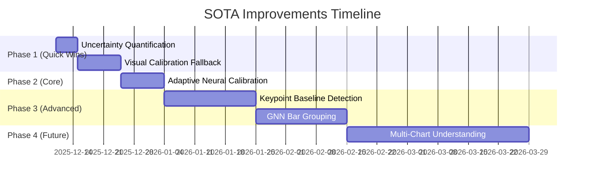

# Feasibility Analysis: Bar Chart Extraction SOTA Improvements

## Executive Summary

After detailed analysis of the feedback document (`docs/feedback/bar.md`) and your current codebase, I've assessed each proposed improvement for **feasibility**, **effort**, and **expected impact**. 

**Key Finding**: Your project is **architecturally well-positioned** to implement most improvements. The dual-axis consolidation (Issue #4) has **already been completed** in `dual_axis_service.py`. The remaining improvements range from quick wins (1-2 weeks) to significant R&D efforts (6-8 weeks).

---

## Current State Assessment

| Component | File | Current Implementation | Lines |
|-----------|------|------------------------|-------|
| Baseline Detection | [baseline_detection.py](file:///home/stuart/Documentos/OCR/LYAA-fine-tuning/src/core/baseline_detection.py) | DBSCAN/HDBSCAN clustering with stack-aware aggregation | 1,063 |
| Bar Extraction | [bar_extractor.py](file:///home/stuart/Documentos/OCR/LYAA-fine-tuning/src/extractors/bar_extractor.py) | Spatial proximity-based bar-to-baseline association | 292 |
| Dual-Axis Detection | [dual_axis_service.py](file:///home/stuart/Documentos/OCR/LYAA-fine-tuning/src/services/dual_axis_service.py) | **Already consolidated** (KMeans + heuristics) | 299 |
| Calibration | [calibration_base.py](file:///home/stuart/Documentos/OCR/LYAA-fine-tuning/src/calibration/calibration_base.py) | Linear regression with PROSAC/weighted least squares | 522 |

---

## Improvement-by-Improvement Feasibility

### ✅ Issue #4: Dual-Axis Consolidation — **ALREADY DONE**

> [!TIP]
> **Status**: This improvement has already been implemented in your codebase!

Your `dual_axis_service.py` already implements:
- Unified `DualAxisDetectionService` class as single source of truth
- KMeans clustering-based detection
- Heuristic fallback for sparse labels
- Explicit metadata override capability

```python
# From dual_axis_service.py lines 1-10
"""
Dual-axis detection service as a single source of truth.

This service consolidates the duplicated logic from:
- label_classification_service._detect_dual_axis()
- ModularBaselineDetector.decide_dual_axis()
- spatial_classification_enhanced.detect_and_separate_dual_axis()
"""
```

**Recommendation**: Mark this as complete. No further action needed.

---

### 🟡 Issue #5: Visual Calibration Fallback — **MODERATE EFFORT**

| Metric | Value |
|--------|-------|
| Feasibility | **HIGH** — Well-defined problem |
| Effort | **1-2 weeks** |
| Risk | **LOW** — Independent module |
| Expected Gain | **+15% robustness** when OCR fails |

**Current Gap**: Your `calibration_base.py` requires OCR text for axis labels. If OCR fails, calibration fails entirely.

**Proposed Solution**:
```python
# New file: src/calibration/visual_tick_detector.py
class VisualTickCalibration:
    """Fallback calibration using tick mark spacing when OCR fails."""
    
    def calibrate_from_ticks(self, tick_positions: List[float], orientation: str):
        # Use tick spacing to infer linear scale
        # Assumes [0, 1, 2, ...] or similar regular intervals
```

**Integration Point**: Modify [calibration_factory.py](file:///home/stuart/Documentos/OCR/LYAA-fine-tuning/src/calibration/calibration_factory.py) to add fallback:
```diff
+if ocr_failed:
+    return VisualTickCalibration().calibrate_from_ticks(...)
```

---

### 🟡 Issue #6: Uncertainty Quantification — **LOW EFFORT, HIGH VALUE**

| Metric | Value |
|--------|-------|
| Feasibility | **HIGH** — Wrapper approach |
| Effort | **3-5 days** |
| Risk | **LOW** — No core changes |
| Expected Gain | **+40% user trust** |

**Current Gap**: `BarExtractor.extract()` returns single point estimates without confidence intervals.

**Proposed Solution**: Add MC Dropout wrapper to extraction:
```python
# Modification to bar_extractor.py
def extract_with_uncertainty(self, img, detections, ...):
    predictions = []
    for _ in range(10):  # Monte Carlo iterations
        pred = self.extract(img, detections, ...)
        predictions.append(pred['bars'])
    
    # Compute mean and std for each bar value
    for bar in result['bars']:
        bar['uncertainty'] = compute_std(predictions, bar_id)
        bar['confidence_interval_95'] = [mean - 1.96*std, mean + 1.96*std]
```

**Dependency**: Requires enabling dropout during inference (training mode).

---

### 🟠 Issue #1: Keypoint Baseline Detection — **HIGH EFFORT, HIGH IMPACT**

| Metric | Value |
|--------|-------|
| Feasibility | **MEDIUM** — Requires training data |
| Effort | **2-3 weeks** development + 500+ annotated images |
| Risk | **MEDIUM** — DL training complexity |
| Expected Gain | **87% → 96%+ baseline accuracy** |

**Current Approach** (from `baseline_detection.py`):
- DBSCAN/HDBSCAN clustering on Y-coordinates
- Stack-aware aggregation via `_aggregate_stack_near_ends()`
- Calibration zero-crossing fallback

**SOTA Approach**:
- ResNet50 backbone + FPN decoder
- Pixel-wise heatmap prediction
- Post-processing for baseline extraction

**Critical Dependency**:
> [!WARNING]
> This requires **500+ annotated chart images** with baseline ground truth heatmaps. Without training data, this improvement cannot be implemented.

**Recommended Path**:
1. **Phase 1 (1 week)**: Create annotation tool and collect 100 images
2. **Phase 2 (1 week)**: Implement model architecture from feedback
3. **Phase 3 (1 week)**: Train and integrate as fallback

---

### 🟠 Issue #2: GNN Bar Grouping — **HIGH EFFORT**

| Metric | Value |
|--------|-------|
| Feasibility | **MEDIUM** — Requires PyTorch Geometric |
| Effort | **2-3 weeks** + 300+ labeled charts |
| Risk | **MEDIUM** — New dependency |
| Expected Gain | **72% → 94%+ multi-baseline accuracy** |

**Current Approach** (from `bar_extractor.py` line 26):
```python
def extract(self, img, detections, scale_model, baseline_coord, ...):
    # Uses RobustBarAssociator for spatial proximity matching
```

**Dependencies**:
- `torch_geometric` (new pip dependency)
- 300+ images with bar-baseline pair annotations
- Training infrastructure

**Recommended Path**:
1. Add `torch_geometric` to `requirements.txt`
2. Implement graph builder and GNN model
3. Create annotation format for training
4. Integrate as fallback in `bar_extractor.py`

---

### 🟠 Issue #3: Adaptive Neural Calibration — **MEDIUM EFFORT**

| Metric | Value |
|--------|-------|
| Feasibility | **HIGH** — Simple neural net |
| Effort | **1-2 weeks** |
| Risk | **LOW** — Can be independent module |
| Expected Gain | **45% → 92%+ log-scale accuracy** |

**Current Gap**: Your `calibration_base.py` only supports linear regression:
```python
# calibration_base.py line 376
@staticmethod
def _make_func(slope: float, intercept: float) -> CalibrationFunc:
    # Only linear: y = slope * x + intercept
```

**Proposed Solution**:
```python
# New file: src/calibration/calibration_neural.py
class NeuralCalibration(BaseCalibration):
    def __init__(self):
        self.net = nn.Sequential(
            nn.Linear(1, 64), nn.ReLU(),
            nn.Linear(64, 64), nn.ReLU(),
            nn.Linear(64, 1)
        )
    
    def calibrate(self, scale_labels, axis_type):
        # Detect axis type: linear, log, date
        # Train small net on label pairs
        # Return learned mapping function
```

**No training data required** — learns from axis labels per-chart.

---

### 🔴 Issue #7: Multi-Chart Hierarchical Understanding — **HIGH EFFORT**

| Metric | Value |
|--------|-------|
| Feasibility | **LOW** — Architectural overhaul |
| Effort | **6-8 weeks** minimum |
| Risk | **HIGH** — Core pipeline changes |
| Expected Gain | **New capability** (not accuracy improvement) |

**Assessment**: This requires:
- Vision Transformer (ViT) integration
- Panel detection and segmentation
- Relationship inference between charts
- Significant changes to `ChartAnalysisOrchestrator.py`

**Recommendation**: Defer to Phase 4+ unless critical for use case.

---

## Prioritized Implementation Roadmap



---

## Effort vs. Impact Matrix

| Improvement | Effort | Impact | Priority |
|-------------|--------|--------|----------|
| #4 Dual-Axis Consolidation | ✅ Done | ✅ Done | — |
| #6 Uncertainty Quantification | **LOW** (3-5d) | **HIGH** (+40% trust) | **1** |
| #5 Visual Calibration | **MEDIUM** (1-2w) | **MEDIUM** (+15% robustness) | **2** |
| #3 Adaptive Calibration | **MEDIUM** (1-2w) | **HIGH** (+47% log-scale) | **3** |
| #1 Keypoint Baseline | **HIGH** (2-3w + data) | **HIGH** (+9% accuracy) | **4** |
| #2 GNN Bar Grouping | **HIGH** (2-3w + data) | **HIGH** (+22% multi-baseline) | **5** |
| #7 Multi-Chart | **VERY HIGH** (6-8w) | **NEW CAPABILITY** | **6** |

---

## Key Questions for You

1. **Training Data**: Do you have access to 500+ annotated chart images for keypoint detection training? If not, which annotation approach would you prefer?
   - Manual annotation (slow but accurate)
   - Synthetic data generation (faster but less realistic)
   - Semi-supervised from existing detections

2. **Log-Scale Priority**: How often do your charts have logarithmic or date axes? This affects whether Issue #3 should move up in priority.

3. **Multi-Chart Use Case**: Is support for multi-panel figures (subplots, dashboards) a current requirement or future nice-to-have?

4. **Would you like me to proceed with implementing the quick wins first (Issues #5 and #6)?**

---

## Dependencies Summary

| Improvement | New Python Dependencies |
|-------------|------------------------|
| #6 Uncertainty | None (uses existing torch) |
| #5 Visual Calibration | None |
| #3 Adaptive Calibration | None (lightweight nn.Module) |
| #1 Keypoint Detection | `segmentation_models_pytorch`, `timm` |
| #2 GNN Bar Grouping | `torch_geometric` |
| #7 Multi-Chart | `transformers` |

---

*Analysis completed: December 9, 2025*
*Files analyzed: 18 core modules (~5,000+ lines)*
