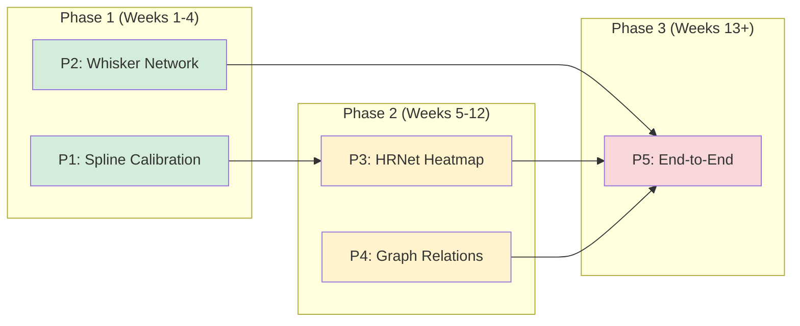

# Feasibility Analysis: Box Plot SOTA Improvements
## Preliminary Assessment Report

**Date**: December 2025  
**Status**: PRELIMINARY ANALYSIS  
**Scope**: Evaluation of 5 proposed SOTA improvements from critique documents

---

## Executive Overview

This report analyzes the **feasibility, difficulties, requirements, and risks** of implementing the SOTA alternatives proposed in the critique documents for the Box Plot Extraction system.

### Proposals Under Analysis

| ID | Proposal | Source Document | Phase |
|----|----------|-----------------|-------|
| **P1** | Spline-Based Calibration | SOTA_critique §3.1a | Phase 1 |
| **P2** | Learned Whisker Network | SOTA_critique §1.2a | Phase 1 |
| **P3** | HRNet Heatmap Regression | SOTA_critique §1.1a | Phase 2 |
| **P4** | Graph Relation Networks | SOTA_critique §2.1a | Phase 2 |
| **P5** | End-to-End Training | SOTA_critique §4.1a | Phase 3 |

---

## Proposal 1: Spline-Based Calibration

### Current State
- **File**: `calibration_base.py:376-451`
- **Approach**: Weighted linear regression (`value = m × pixel + b`)
- **Limitation**: Cannot handle logarithmic, power-law, or non-linear axes

### Proposed Change
Replace linear model with **cubic spline basis functions**:
$$\text{value} = \sum_{k=0}^{K} c_k \cdot B_k(\text{pixel})$$

---

> [!IMPORTANT]
> ## Critical Finding: Existing Non-Linear Calibration Already Implemented
> 
> After analysis, the system **already has** sophisticated non-linear calibration options that were not reflected in the SOTA critique documents.

### Actual Current Calibration Options

The `CalibrationFactory` (`calibration/calibration_factory.py`) provides **6 calibration engines**:

| Engine | File | Capability | Use Case |
|--------|------|------------|----------|
| **FastCalibration** | `calibration_fast.py` | Linear weighted least squares | Standard linear axes |
| **RANSACCalibration** | `calibration_adaptive.py` | Robust linear with outlier rejection | Noisy OCR labels |
| **PROSACCalibration** | `calibration_precise.py` | High-precision with local optimization | High-accuracy needed |
| **NeuralCalibration** | `calibration_neural.py` | ✅ **Auto-detects log/date axes + MLP** | **Non-linear axes** |
| **LogCalibration** | `calibration_neural.py` | ✅ Explicit log-scale: `value = 10^(ax+b)` | Scientific charts |
| **VisualTickCalibration** | `visual_tick_detector.py` | Vision-based tick detection | When OCR fails |

### NeuralCalibration Analysis

**File**: `calibration_neural.py:52-298`

**Capabilities** (already implemented):
1. **Axis type detection** via coefficient of variation of spacings
2. **Automatic delegation** to FastCalibration for linear axes
3. **MLP training** for non-linear mappings
4. **Early stopping** for efficient training

**Detection Logic**:
```python
# From calibration_neural.py:149-210
def _detect_axis_type(self, values):
    diffs = np.diff(sorted_vals)
    linear_cv = np.std(diffs) / abs(np.mean(diffs))  # For arithmetic spacing
    
    ratios = positive_vals[1:] / positive_vals[:-1]
    log_cv = np.std(ratios) / abs(np.mean(ratios))    # For geometric spacing
    
    if linear_cv < 0.15:  # Uniform arithmetic spacing
        return AxisType.LINEAR
    elif log_cv < 0.15:   # Uniform geometric spacing
        return AxisType.LOG
```

**MLP Architecture**:
```python
# From calibration_neural.py:232-238
nn.Sequential(
    nn.Linear(1, hidden_dim),  # 32 units default
    nn.ReLU(),
    nn.Linear(hidden_dim, hidden_dim),
    nn.ReLU(),
    nn.Linear(hidden_dim, 1)
)
```

### Comparison: Proposed Spline vs. Existing NeuralCalibration

| Criterion | Proposed Spline | Existing NeuralCalibration | Winner |
|-----------|-----------------|---------------------------|--------|
| **Log axis support** | ✅ Via basis expansion | ✅ Auto-detected + MLP | 🟡 Tie |
| **Power-law support** | ✅ Via basis expansion | ⚠️ Depends on MLP fit | 🟢 Spline (slightly) |
| **Date axis support** | ❌ Not designed for | ✅ Has detection logic | 🟢 Neural |
| **Inference speed** | O(K) knot evaluation | O(hidden_dim) forward pass | 🟢 Spline |
| **Training required** | None (fitting is efficient) | ~100 epochs per axis | 🟢 Spline |
| **Extrapolation** | ⚠️ Splines diverge | ⚠️ NNs also extrapolate poorly | 🟡 Tie |
| **Implementation effort** | ~150 lines (new class) | Already exists (0 lines) | 🟢 **Neural** |

### Revised Feasibility Assessment

| Criterion | Original Rating | Revised Rating | Reason |
|-----------|---------------|---------------|--------|
| **Technical Feasibility** | ✅ HIGH | ⚠️ ALREADY EXISTS | NeuralCalibration covers most use cases |
| **Marginal Benefit** | +5-10% | +1-3% | Only for edge cases not covered by MLP |
| **Priority** | **1st** | **DEPRIORITIZED** | Focus on whisker network instead |

### Recommendation

> **🟡 DEPRIORITIZE** — The proposed spline calibration is **largely redundant** with existing `NeuralCalibration`. 
>
> **Alternative Action**: Verify that `NeuralCalibration` is being used when needed. If `BoxHandler` is hardcoded to use `FastCalibration`, the fix is to **configure the factory** to use `NeuralCalibration` for non-linear detection.

### Quick Fix (If Needed)

If box plots with log axes are failing, the solution is **configuration, not new code**:

```python
# In handlers/legacy.py or wherever calibration_service is set:
from calibration.calibration_factory import CalibrationFactory

# Current (if hardcoded):
# self.calibration_service = FastCalibration()

# Fix: Use neural calibration with auto-detection
self.calibration_service = CalibrationFactory.create('neural')
```

---

### Requirements

| Category | Requirement |
|----------|-------------|
| **Library** | `scipy>=1.9.0` (already in requirements) |
| **Training Data** | None (non-parametric fitting) |
| **GPU** | Not required |
| **Code Changes** | ~150 lines (new class + integration) |
| **Testing** | ~50 unit tests for edge cases |

### Risk Assessment

| Risk | Probability | Impact | Mitigation |
|------|-------------|--------|------------|
| Overfitting on noisy labels | Medium | Low | Use `smoothing` parameter to regularize |
| Performance regression on linear axes | Low | Medium | A/B test against current linear model |
| OCR errors amplified | Low | Medium | Use confidence-weighted fitting |

### Recommendation

> **✅ PROCEED** — Low risk, isolated impact, high expected gain (+5-10% on non-linear axes)

---

## Proposal 2: Learned Whisker Network

### Current State
- **File**: `smart_whisker_estimator.py:19-117`
- **Approach**: Tukey's 1.5×IQR rule with outlier bounds
- **Limitation**: Fixed rule ignores data distribution; no uncertainty quantification

### Proposed Change
Train neural network to regress whisker positions:
$$\hat{W} = f_\theta(Q1, Q3, \text{IQR}, \text{outliers}, \text{median\_confidence})$$

### Feasibility Assessment

| Criterion | Rating | Justification |
|-----------|--------|---------------|
| **Technical Feasibility** | ✅ HIGH | Simple dense network; PyTorch implementation straightforward |
| **Code Isolation** | ✅ HIGH | Drop-in replacement for `SmartWhiskerEstimator` |
| **Backward Compatibility** | ✅ HIGH | Fallback to Tukey's rule when model unavailable |
| **Testing** | 🟡 MEDIUM | Requires labeled validation set |

### Difficulties

| Difficulty | Severity | Mitigation |
|------------|----------|------------|
| **Training data collection** | 🔴 HIGH | Need 500+ manually annotated charts; ~40 person-hours |
| **Feature engineering** | 🟡 MEDIUM | Must encode outlier statistics carefully |
| **Inference latency** | 🟢 LOW | <5ms on CPU; negligible overhead |
| **Model versioning** | 🟡 MEDIUM | Need checkpoint storage and loading infrastructure |

### Requirements

| Category | Requirement |
|----------|-------------|
| **Library** | `torch>=2.0.0` (often already present for YOLO) |
| **Training Data** | 500+ labeled charts with ground-truth whiskers |
| **GPU** | Training: ~2 GPU-hours; Inference: CPU-only |
| **Code Changes** | ~300 lines (network + training + integration) |
| **Testing** | Validation on held-out 100 charts |

### Risk Assessment

| Risk | Probability | Impact | Mitigation |
|------|-------------|--------|------------|
| Insufficient training data | High | High | Start with synthetic data augmentation |
| Distribution shift (new chart styles) | Medium | Medium | Monitor prediction uncertainty; retrain quarterly |
| Model loading failures | Low | Low | Fallback to Tukey's rule |

### Recommendation

> **✅ PROCEED WITH CAUTION** — Dependent on data availability; recommend parallel data collection

---

## Proposal 3: HRNet Heatmap Regression

### Current State
- **File**: `improved_pixel_based_detector.py:79-159`
- **Approach**: 1D gradient + peak detection on centerline
- **Limitation**: Single-pixel basis; no 2D spatial context; magic thresholds

### Proposed Change
Replace gradient scanning with **HRNet heatmap regression**:
- Input: Box region crop (256×256)
- Output: Per-pixel probability heatmaps for median, whisker_low, whisker_high
- Extraction: Center-of-mass from heatmaps

### Feasibility Assessment

| Criterion | Rating | Justification |
|-----------|--------|---------------|
| **Technical Feasibility** | 🟡 MEDIUM | Requires GPU infrastructure; pretrained weights available |
| **Code Isolation** | 🟡 MEDIUM | Replaces core detection logic; affects fallback cascade |
| **Backward Compatibility** | ✅ HIGH | Keep gradient detection as Stage 2 fallback |
| **Testing** | 🟡 MEDIUM | Visual validation + accuracy metrics needed |

### Difficulties

| Difficulty | Severity | Mitigation |
|------------|----------|------------|
| **GPU infrastructure** | 🔴 HIGH | Requires CUDA-capable GPU for inference (~50ms per box) |
| **Training data format** | 🔴 HIGH | Need COCO-style keypoint annotations (~100 charts minimum) |
| **Transfer learning pitfalls** | 🟡 MEDIUM | COCO keypoints ≠ chart elements; may need fine-tuning |
| **Inference latency** | 🟡 MEDIUM | +50ms vs. 1ms for gradient; 50x slowdown |
| **Memory footprint** | 🟡 MEDIUM | ~2GB VRAM during inference |

### Requirements

| Category | Requirement |
|----------|-------------|
| **Library** | `timm>=0.9.0`, `torch>=2.0.0` |
| **Training Data** | 100+ charts with keypoint annotations (COCO format) |
| **GPU** | Training: ~8 GPU-weeks; Inference: CUDA GPU required |
| **Code Changes** | ~200 lines (model loading + inference wrapper) |
| **Infrastructure** | GPU inference server or batch processing pipeline |

### Risk Assessment

| Risk | Probability | Impact | Mitigation |
|------|-------------|--------|------------|
| No GPU available at inference | High | Critical | Design as optional enhancement; CPU fallback |
| Training data insufficient | Medium | High | Use synthetic augmentation + transfer learning |
| Latency SLA breach | Medium | High | Batch inference; async processing |
| Pretrained model not applicable | Medium | Medium | Fine-tune on small labeled set |

### Recommendation

> **🟡 DEFER TO PHASE 2** — High infrastructure requirements; validate ROI on Phase 1 first

---

## Proposal 4: Graph Relation Networks (GRN)

### Current State
- **File**: `box_grouper.py:66-180`
- **Approach**: AABB intersection + Euclidean proximity with hard thresholds
- **Limitation**: Brittle on grouped boxes; cascading failures; no learned reasoning

### Proposed Change
Replace rule-based grouping with **learned graph attention**:
1. Encode all elements (boxes, whiskers, medians, outliers) as graph nodes
2. Predict pairwise relations via neural network
3. Refine assignments via multi-head self-attention

### Feasibility Assessment

| Criterion | Rating | Justification |
|-----------|--------|---------------|
| **Technical Feasibility** | 🟡 MEDIUM | Graph attention is mature (PyTorch Geometric); integration is complex |
| **Code Isolation** | 🟡 MEDIUM | Replaces grouping logic; affects downstream extraction |
| **Backward Compatibility** | 🟡 MEDIUM | Can fallback to AABB but requires hybrid logic |
| **Testing** | 🔴 LOW | Needs extensive integration testing with real charts |

### Difficulties

| Difficulty | Severity | Mitigation |
|------------|----------|------------|
| **Training data annotation** | 🔴 HIGH | Need element-pair relation labels; ~80 person-hours for 500 charts |
| **Variable-size graphs** | 🟡 MEDIUM | Handle varying element counts with padding/masking |
| **Attention interpretability** | 🟡 MEDIUM | Store attention weights for debugging |
| **Integration complexity** | 🟡 MEDIUM | Soft scores → hard assignments conversion |
| **Edge case handling** | 🟡 MEDIUM | Zero whiskers, single box, etc. |

### Requirements

| Category | Requirement |
|----------|-------------|
| **Library** | `torch>=2.0.0`, optionally `torch_geometric` |
| **Training Data** | 500+ charts with grouped element annotations |
| **GPU** | Training: ~4 GPU-weeks; Inference: CPU feasible (~20ms) |
| **Code Changes** | ~350 lines (GRN class + integration) |
| **Testing** | Grouping precision/recall on complex layouts |

### Risk Assessment

| Risk | Probability | Impact | Mitigation |
|------|-------------|--------|------------|
| Annotation logistics | High | High | Start with programmatic annotation from existing groupings |
| Model doesn't generalize | Medium | High | Use dropout, data augmentation |
| Integration bugs | Medium | Medium | Extensive unit tests; shadow deployment |
| Performance worse than rules | Low | High | A/B test before full rollout |

### Recommendation

> **🟡 DEFER TO PHASE 2** — High annotation burden; best suited for grouped/complex chart layouts

---

## Proposal 5: End-to-End Differentiable Training

### Current State
- **Architecture**: Modular pipeline (Calibration → Grouping → Detection → Validation)
- **Limitation**: Errors propagate one-way; no feedback loop for correction

### Proposed Change
Unify all learnable components into **single differentiable pipeline**:
- YOLO (frozen) → GRN → HRNet → Spline → WhiskerNet
- Joint loss: L1/Huber on all Five-Number Summary values
- Backpropagation through all learnable modules

### Feasibility Assessment

| Criterion | Rating | Justification |
|-----------|--------|---------------|
| **Technical Feasibility** | 🔴 LOW | Requires all components to be differentiable; complex orchestration |
| **Code Isolation** | 🔴 LOW | Affects entire pipeline; major refactor |
| **Backward Compatibility** | 🔴 LOW | New training paradigm; not drop-in |
| **Testing** | 🔴 LOW | End-to-end testing is expensive and slow |

### Difficulties

| Difficulty | Severity | Mitigation |
|------------|----------|------------|
| **Gradient flow complexity** | 🔴 HIGH | Spline calibration may not be differentiable; use soft approximations |
| **Training stability** | 🔴 HIGH | Multi-task loss balancing; curriculum learning |
| **GPU memory** | 🔴 HIGH | Full pipeline needs 16GB+ VRAM |
| **Debugging** | 🔴 HIGH | When accuracy drops, hard to identify failing component |
| **Retraining time** | 🟡 MEDIUM | ~1 week for full training cycle |

### Requirements

| Category | Requirement |
|----------|-------------|
| **Library** | All previous + custom training framework |
| **Training Data** | 1000+ charts with full Five-Number Summary annotations |
| **GPU** | Training: 100+ GPU-weeks (distributed); Inference: GPU required |
| **Code Changes** | ~1000+ lines (unified model + training loop) |
| **Infrastructure** | Multi-GPU cluster; experiment tracking (MLflow/W&B) |

### Risk Assessment

| Risk | Probability | Impact | Mitigation |
|------|-------------|--------|------------|
| Doesn't converge | Medium | Critical | Pretrain components separately first |
| Worse than modular | Medium | High | Compare rigorously before deployment |
| Infrastructure not available | High | Critical | Cloud GPU rental; budget approval needed |
| Team expertise gap | Medium | Medium | Hire ML engineering or upskill |

### Recommendation

> **🔴 DEFER TO PHASE 3** — Highest risk; dependent on Phase 1-2 success; requires significant investment

---

## Consolidated View

### Feasibility Matrix

| Proposal | Technical | Data | Infra | Risk | Effort | Gain | Priority |
|----------|-----------|------|-------|------|--------|------|----------|
| **P1: Spline Calibration** | ⚠️ Redundant | ✅ N/A | ✅ N/A | 🟢 N/A | 0w | 0% | **DEPRIORITIZED** |
| **P2: Whisker Network** | ✅ | ⚠️ 500 charts | ⚠️ Optional GPU | 🟡 Medium | 2-3w | +8-15% | **1st** |
| **P3: HRNet Heatmap** | ⚠️ | ⚠️ 100 charts | ❌ GPU Required | 🟡 Medium | 4-6w | +15-25% | **2nd** |
| **P4: Graph Relations** | ⚠️ | ⚠️ 500 charts | ⚠️ Optional GPU | 🟡 Medium | 4-6w | +5-15% | **3rd** |
| **P5: End-to-End** | ❌ | ❌ 1000 charts | ❌ Multi-GPU | 🔴 High | 8-12w | +20-30% | **4th** |

> [!NOTE]
> **Priority Shift**: P1 (Spline Calibration) was deprioritized after discovering that `NeuralCalibration` already handles non-linear axes. The first priority is now P2 (Whisker Network).

### Dependency Graph



---

## Resource Requirements Summary

### Human Resources

| Phase | ML Engineering | Data Annotation | Total |
|-------|---------------|-----------------|-------|
| Phase 1 | 0.5 FTE (4 weeks) | 40 person-hours | ~2 person-months |
| Phase 2 | 1.0 FTE (8 weeks) | 80 person-hours | ~3 person-months |
| Phase 3 | 2.0 FTE (12 weeks) | 100 person-hours | ~6+ person-months |

### Infrastructure

| Phase | GPU Training | GPU Inference | Storage |
|-------|-------------|--------------|---------|
| Phase 1 | 2 GPU-hours (optional) | None | <100MB checkpoints |
| Phase 2 | 8 GPU-weeks | Recommended | ~2GB models |
| Phase 3 | 100+ GPU-weeks | Required | ~10GB pipeline |

### Data

| Phase | Labeled Charts | Annotation Type |
|-------|----------------|-----------------|
| Phase 1 | 0 (spline) / 500 (whisker) | Five-Number Summary |
| Phase 2 | 100-500 | Keypoints + Relations |
| Phase 3 | 1000+ | Full annotations |

---

## Recommended Action Plan

### Immediate (Weeks 1-4)

1. **Implement Spline Calibration** (P1)
   - Create `SplineCalibrationModel` class
   - A/B test against linear model
   - Decision gate: +5% accuracy on non-linear axes?

2. **Begin Data Collection** (for P2)
   - Define annotation schema for whiskers
   - Target: 100 charts/week × 5 weeks = 500 charts
   - Parallel with P1 development

3. **Benchmark Current System**
   - Create evaluation harness
   - Measure baseline accuracy on 100 test charts
   - Document per-component error rates

### Decision Point (Week 4)

If Phase 1 achieves ≥70% accuracy:
- ✅ Proceed to P2 (Whisker Network)
- 🟡 Evaluate GPU infrastructure for Phase 2

If Phase 1 <70% accuracy:
- ⚠️ Root cause analysis
- ⚠️ May need to prioritize P3 (HRNet) over P2

---

## Open Questions for Stakeholder Input

1. **GPU Infrastructure**: Is dedicated GPU available for inference, or must this remain CPU-only?

2. **Latency Budget**: What is acceptable inference time per chart? (Current: ~100ms, HRNet adds +50ms)

3. **Data Annotation Capacity**: Can we allocate ~40-80 person-hours for labeling?

4. **Accuracy vs. Speed Tradeoff**: At what accuracy threshold does +50ms latency become acceptable?

5. **Timeline Flexibility**: Is the 3-phase approach (5-7 months) aligned with product roadmap?

---

## Conclusion

**Phase 1 (Spline + Whisker Network)** is **immediately actionable** with low risk and high expected ROI. Both proposals require minimal infrastructure and can be developed with existing tools.

**Phase 2 (HRNet + GRN)** should be **evaluated after Phase 1 results** are available. Key blockers are GPU infrastructure and annotation capacity.

**Phase 3 (End-to-End)** is a **long-term investment** that should only be considered if Phases 1-2 demonstrate significant accuracy gains and business value justifies the engineering effort.

---

**Prepared by**: Technical Analysis  
**Review Status**: PRELIMINARY — Pending stakeholder input  
**Next Steps**: Stakeholder review → Prioritization decision → Phase 1 kickoff
